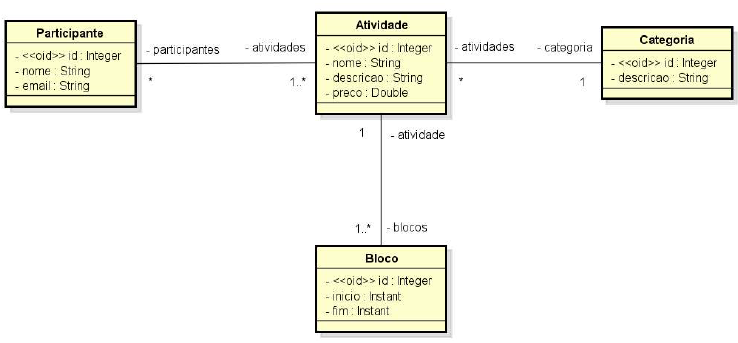
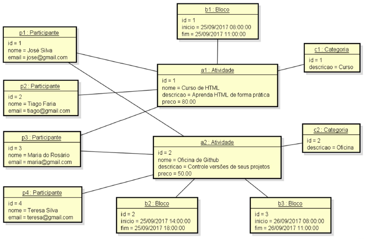

# 🎯 Desafio: Modelo de Domínio e ORM

> Projeto desenvolvido como parte da **Formação Java Spring Professional** - DevSuperior com foco em modelagem de domínio e mapeamento ORM com JPA/Hibernate.

## 📌 Objetivo do Projeto

Implementar um sistema para gerenciamento de participantes e atividades de um evento acadêmico, aplicando:
    - Modelagem de domínio orientada a objetos
   - Mapeamento objeto-relacional (ORM)
   - Relacionamentos entre entidades (1:N e N:N)
   - Seeding automático do banco de dados

### Tecnologias Utilizadas
- ✅ Java 21
- ✅ Spring Boot 4.0.2
- ✅ Spring Data JPA
- ✅ Hibernate
- ✅ Banco de dados H2 (em memória)
- ✅ Maven

## 🧠 Modelo de Domínio

O modelo conceitual proposto no enunciado é o seguinte:


O sistema é composto pelas seguintes entidades:

```
┌─────────────┐       ┌──────────────┐       ┌───────────────┐
│  Categoria  │ 1   N │   Atividade  │ N   N │ Participante  │
│─────────────│◄──────│──────────────│◄─────►│───────────────│
│ id          │       │ id           │       │ id            │
│ descricao   │       │ nome         │       │ nome          │
└─────────────┘       │ descricao    │       │ email         │
                      │ preco        │       └───────────────┘
                      └──────────────┘
                             │
                             │ 1
                             │
                             │ N
                      ┌──────▼───────┐
                      │    Bloco     │
                      │──────────────│
                      │ id           │
                      │ inicio       │
                      │ fim          │
                      └──────────────┘
```

#### 🗂️ Categoria

Representa o tipo da atividade (Curso, Oficina).

| Atributo  | Tipo   |
| --------- | ------ |
| id        | Long   |
| descricao | String |

#### 🎯 Atividade

Atividades oferecidas no evento.

| Atributo  | Tipo   |
| --------- | ------ |
| id        | Long   |
| nome      | String |
| descricao | String |
| preco     | Double |

#### 👩‍💻 Participante

Usuários inscritos nas atividades.

| Atributo | Tipo   |
| -------- | ------ |
| id       | Long   |
| nome     | String |
| email    | String |


#### 🕒 Bloco

Representa os horários em que as atividades ocorrem.

| Atributo | Tipo          |
| -------- | ------------- |
| id       | Long          |
| inicio   | LocalDateTime |
| fim      | LocalDateTime |

## 🚀 Como Executar

### Pré-requisitos
- Java 21 ou superior
- Maven 4.x

### Passos

1. **Clone o repositório**
```bash
git clone git@github.com:iolymmoliveira/desafios_java_spring.git
cd desafio02
```

2. **Execute o projeto**
```bash
mvn spring-boot:run
```

3. **Acesse o H2 Console**
```
URL: http://localhost:8080/h2-console
```

**Dados de conexão:**
- **JDBC URL:** `jdbc:h2:mem:testdb`
- **Username:** `sa`
- **Password:** *(deixe em branco)*

## 📁 Estrutura do Projeto

```
├── src/
│ ├── main/
│ │ ├── java/
│ │ │ └── com.iolyoliveira.desafio02/
│ │ │ ├── entities/
│ │ │ │ ├── Atividade.java
│ │ │ │ ├── Bloco.java
│ │ │ │ ├── Categoria.java
│ │ │ │ └── Participante.java
│ │ │ └── Desafio02Application.java
│ │ └── resources/
│ │ ├── application.properties
│ │ ├── application-test.properties
│ │ └── import.sql
│
├── docs/
│ ├── modelo-dominio.png
│ └── instancia-dados.png
│
├── pom.xml
└── README.md
```

## 🌱 Instância dos Dados para Seeding

O banco é populado automaticamente ao iniciar a aplicação, conforme a instância de objetos fornecida no enunciado:




## 🚀 Resultado

O sistema cria automaticamente todas as tabelas e relacionamentos ao iniciar a aplicação, e o banco já sobe populado com os dados do cenário do evento acadêmico.

## 👩‍💻 Autora

**Ioly Oliveira**  
Desenvolvedora Full Stack com foco em **React, TypeScript e Java (Spring Boot)**.  
Experiência em construção de aplicações web, modelagem de banco de dados e integração entre frontend e backend.

🔗 **LinkedIn:** https://www.linkedin.com/in/iolymmoliveira/  
💻 **GitHub:** https://github.com/iolymmoliveira

## 📝 Licença

Este projeto foi desenvolvido para fins educacionais.
